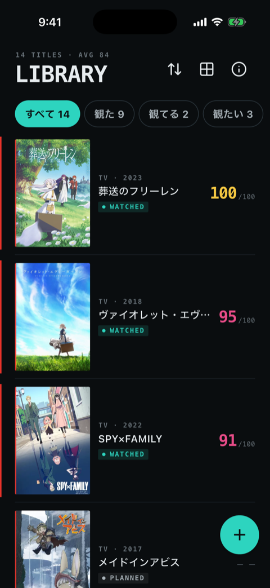
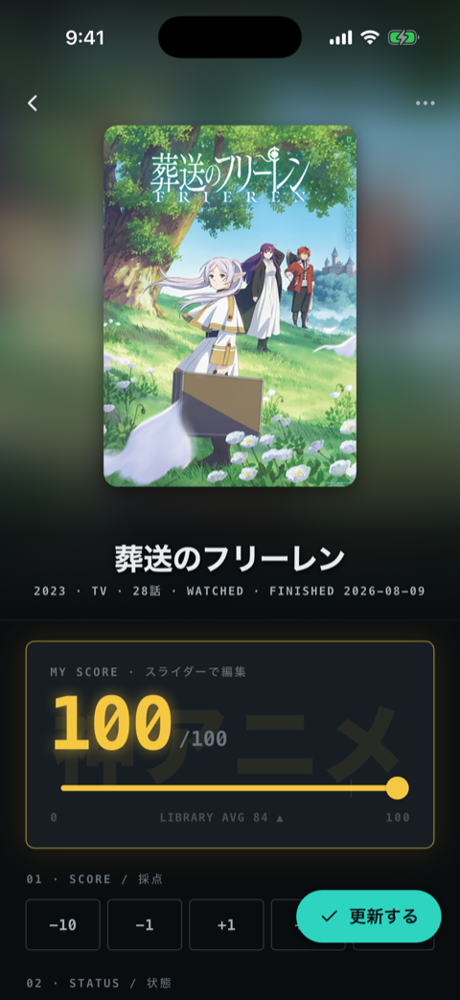

# Gen（4arms）

Flutter で iOS アプリと OSS を作っています。公開しているものは、アニメ記録アプリ「アニ100」（App Store）、Apple HIG 準拠のタイポグラフィパッケージ「cupertino_typography」（pub.dev）とその開発のきっかけになった調査記事（Zenn）、AI エージェントと開発するための自作プラグイン集「agent-plugins」です。

これまでは別の業種で働きながら、「個人で稼げるようになる」ことを目標に挑戦を続けてきました。30歳が見えてきたのを機に作戦を変え、実務の中で AI 込みの開発力を本物の技術力に鍛え直したいと考えて、いまはエンジニアとして働ける場を探しています。個人開発は、これからも続けます。この README は、その公開物・関心・経緯をまとめた自己紹介です。

✍️ Zenn: [zenn.dev/4arms](https://zenn.dev/4arms)

## いま関心があること・これから学びたいこと・感じている課題

AI のおかげで、小さなアプリをリリースまで持っていくことも、開発ハーネスを自作することもできるようになりました。ただ、それをある種のドーピングのように感じている面もあって、自分自身の技術力を並行して高めていく必要があると考えています。

- **開発用ハーネスの改善とテスト手法** — 自作の plan 駆動開発プラグイン（後述の crystallize）を使っていて、認識合わせの精度とトークン効率に課題を感じているので改善したいです。AI に実装を任せる開発ではテストがいっそう重要になると感じていて、『知識ゼロから学ぶソフトウェアテスト 第3版』を読みながらテスト手法を学び直しています。
- **アニ100 の集客** — ユーザーはまだ 30 人ほどです。観ているアニメを共有できる機能を追加した上で、X 広告での集客を試す予定です。
- **RDB を土台にしたアプリ構築** — 『達人に学ぶDB設計 徹底指南書』で設計を学び直していて、次に作るものは SQL（RDB）を土台にするつもりです。きっかけは、リレーショナルな要件に Firestore を選んでしまい、参照用コレクションやクライアント側での結合が増えて設計に苦労した経験です。要件に合わせてデータベースを選べるようになるのが狙いです。
- **セキュリティの基礎** — AI がコードを書く時代こそ必要になると感じていて、学習対象に加えています。

## 公開しているもの

### 📱 アニ100 — 100点満点のアニメ記録アプリ（iOS）

[App Store](https://apps.apple.com/jp/app/id6767991451) ／ [ani100.com](https://ani100.com)

0〜100点でアニメを記録する、自分だけの記録アプリです（SNS機能なし・アカウント不要・広告なし）。

アニメや漫画を観たら、自分なりの基準で分析して点数をつける習慣があります。ただ、既存の記録アプリは星5段階の大雑把な評価しかできず物足りなくて、細かい点数や分析はスマホのメモ帳に書き溜めていました。「メモ帳代わりになるくらいシンプルなアプリなら、AI のサポートと以前のプログラミング経験があれば自分でも作れるのでは」と思い立ち、開発しました。

100点満点なのは、星5段階だと「星3寄りの星4」と「星5寄りの星4」が同じ星4になってしまうのが不満だったからです。

技術構成: Flutter / Riverpod（riverpod_generator・riverpod_lint 併用）/ freezed / go_router / feature-first のレイヤー分離（application・data・presentation）。作品データは MyAnimeList・AniList（GraphQL）の API から取得、記録の保存は shared_preferences（SQLite への移行を予定）

  
  

### 📦 cupertino_typography — Apple HIG の 11 テキストスタイルを Flutter に

[pub.dev](https://pub.dev/packages/cupertino_typography) ／ [github.com/4armsxlr8/cupertino_typography](https://github.com/4armsxlr8/cupertino_typography)

Apple HIG の 11 テキストスタイルを Flutter の TextStyle として提供し、Material の TextTheme にブリッジするパッケージです。Flutter の iOS デフォルト文字組みをエンジンのソースまで掘って調べた記事から生まれました。

- 調査の記録: [iOSで感じるFlutter臭の正体を調査したら、タイポグラフィがキメラだった](https://zenn.dev/4arms/articles/flutter-ios-typography-chimera)（Zenn）
- 検証アプリ: [cupertino_text_theme_compare](https://github.com/4armsxlr8/cupertino_text_theme_compare)

### 🔧 agent-plugins — Claude Code / Codex プラグイン集

[github.com/4armsxlr8/agent-plugins](https://github.com/4armsxlr8/agent-plugins)

AI エージェントとの開発で実際に困ったこと（対話で決めた確定事項が流れて消える・アーキテクチャ違反にすぐ気づけない）を、開発ハーネスとして解決してプラグイン化したものです。

- **[crystallize](https://github.com/4armsxlr8/agent-plugins/blob/main/plugins/crystallize/README.md)** — 仕様決め → 実装 → 3段階の検証 → コミットを1本のフローで進める plan 駆動開発
- **[flutter-riverpod-guardrails](https://github.com/4armsxlr8/agent-plugins/blob/main/plugins/flutter-riverpod-guardrails/README.md)** — Riverpod プロジェクト向けの Clean Architecture レイヤー違反検査と pre-commit lint。独学で身につけたアーキテクチャ規約を、エージェントが機械的に検査できるルールに落としたもの

## 開発中

- **[crux_ui](https://github.com/4armsxlr8/crux_ui)** — デザイントークン・テーマ層・18個のコンポーネントからなる Flutter UI キット。typography はプラットフォームごとに HIG / Material 3 のスケールへ解決される
- **study-loop** — 学習科学のメタ分析に設計根拠を持つ段階的学習プラグイン（[README](https://github.com/4armsxlr8/agent-plugins/blob/main/dev/study-loop/README.ja.md)）

## これまで

| 時期 | できごと |
|---|---|
| 〜2020 | PHP を独学でかじる |
| 2021 | 友人に誘われサービス立ち上げに挑戦。Flutter・Firebase・UI デザインを独学 |
| 2022 | pub.dev に初期パッケージを公開 |
| 2023 | サービスは公開に至らないまま自然消滅。初の個人アプリ（タイムカプセル型の写真アプリ）で App Store 審査に挑むもリジェクトされ、燃え尽きて開発から離れる |
| 2024–2025 | 生成 AI での小説作りにハマり、1年ほど物語を読みあさる。作品を分析して点数をつける習慣が生まれる（のちのアニ100 の原点） |
| 2025 | 友人との新サービスを機に開発を再開し、Coding Agent を使い始める（サービスは公開手前で凍結中） |
| 2026 | アニ100 を App Store にリリース。「作っても出していない」ことに気づき、cupertino_typography・Zenn の調査記事・agent-plugins の公開と発信を始める |